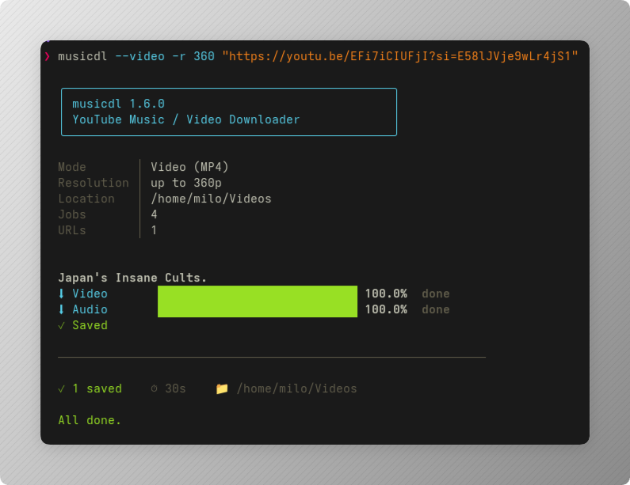

# musicdl `1.6.0`

YouTube Music / Video downloader written in `fish`. Pretty progress UI, parallel
fragments, MP3 with real album art, MP4 video, playlist-aware output layout.

Single file: [`musicdl`](./musicdl) — symlink it onto your `PATH` and develop here.



## Features

- **Music mode (default):** MP3 with `--embed-metadata` + `--embed-thumbnail`
- **Video mode:** MP4 (`bv*+ba` merge), capped by `--resolution`
- **Playlists:** one URL = whole playlist, sensible folder layout
- **Real cover art:** iTunes Search → Deezer fallback, replaces YouTube thumbnail
  when a title match is found (uses `ffprobe` tags + `ffmpeg` remux, no re-encode)
- **Pretty TTY UI:** per-track title, `⬇ Video / Audio` bars, `⚙ Converting… /
  Merging… / Embedding…` stages, final `✓ Saved`
- **Pipe-safe:** non-TTY output degrades to plain lines (`⬇ label 100%`,
  `⚙ stage…`)
- **Resumable:** `--continue --no-overwrites`, exit-code-aware summary
  (`0` ok, `130` interrupted → re-run to resume, else retry-failed hint)

## Requirements

### Environment

- Shell: **fish ≥ 3.x** (tested on `fish 4.9.3`)
- OS: Linux (developed on CachyOS / Arch). Works on any distro / macOS if deps exist.
- Terminal tools: `tput` (ncurses), `mktemp`, `head`, `cat`

### Dependencies

| Binary   | Used for                              | Required when          |
| -------- | ------------------------------------- | ---------------------- |
| `yt-dlp` | download / extract / merge / tag      | always                 |
| `ffmpeg` | convert, merge, thumbnail crop, remux | always (+ `ffprobe`)   |
| `curl`   | iTunes / Deezer art lookup + download | music without `--no-art` |
| `jq`     | parse iTunes / Deezer JSON            | music without `--no-art` |

Tested versions:

```text
fish 4.9.3
yt-dlp 2026.08.19
ffmpeg n9.0.2 (with ffprobe)
curl 8.22.0
jq 1.8.2
```

> The script checks deps at startup and aborts with
> `✗ <dep> is not installed. Install it with: sudo pacman -S <dep>`.

### Install deps

Arch / CachyOS:

```bash
sudo pacman -S fish yt-dlp ffmpeg curl jq
```

Ubuntu / Debian:

```bash
sudo apt install fish yt-dlp ffmpeg curl jq
```

Fedora:

```bash
sudo dnf install fish yt-dlp ffmpeg curl jq
```

macOS (Homebrew):

```bash
brew install fish yt-dlp ffmpeg curl jq
```

## Install (dev setup with symlink)

This repo **is** the source of truth. The executable on `PATH` is a symlink to it:

```bash
git clone <your-remote> ~/Projects/musicdl
chmod +x ~/Projects/musicdl/musicdl
ln -s ~/Projects/musicdl/musicdl ~/.local/bin/musicdl
# ensure ~/.local/bin is on PATH
fish -c 'musicdl --version'
```

Current machine state:

```text
/home/milo/Projects/musicdl/musicdl  (real file, edit here)
~/.local/bin/musicdl -> /home/milo/Projects/musicdl/musicdl  (symlink)
```

Edit `~/Projects/musicdl/musicdl`, the change is live immediately — no reinstall.

## Usage

```text
musicdl [OPTIONS] URL [URL...]
```

Each URL can be a single song/video or a whole playlist.

### Modes

```bash
musicdl 'https://youtube.com/watch?v=...'          # music (default)
musicdl --music 'https://youtube.com/playlist?list=...'
musicdl --video 'https://youtube.com/watch?v=...'
```

### Audio quality

| Flag                  | Values                              |
| --------------------- | ----------------------------------- |
| `-q, --quality`       | `best` (320) `good` (256) `normal` (192) `small` (128) |
| `-a, --audio-quality` | exact MP3 bitrate: `128 192 256 320` (overrides `-q`) |

```bash
musicdl -q good 'URL'
musicdl -a 192 'URL1' 'URL2'
```

> YouTube's own audio is roughly 128–160 kbps, so 320 kbps MP3 gives larger
> files but not better sound. 192 is plenty for most uses.

### Video

| Flag               | Values                                              |
| ------------------ | --------------------------------------------------- |
| `-r, --resolution` | `240 360 480 720 1080` (default) `1440 2160`        |

```bash
musicdl --video -r 360 'URL'
musicdl --video -r 2160 -o ~/Movies 'URL'
```

Format string used:

```text
bv*[height<=RES]+ba/b[height<=RES]/b  +  --merge-output-format mp4
```

### General

| Flag             | Default              | Meaning                                        |
| ---------------- | -------------------- | ---------------------------------------------- |
| `-o, --output`   | `~/Music` / `~/Videos` | base folder (`~` is expanded, created if missing) |
| `-j, --jobs N`   | `4`                  | concurrent fragments (`--concurrent-fragments`) |
| `--no-playlist`  | off                  | video-in-playlist URL → only that video        |
| `--no-art`       | off                  | keep YouTube thumbnail, skip iTunes/Deezer     |
| `-h, --help`     | —                    | show help                                      |
| `--version`      | —                    | show version                                   |

More examples:

```bash
musicdl --no-playlist 'https://youtube.com/watch?v=...&list=...'
musicdl --no-art 'URL'
musicdl -o ~/Music/rips -j 8 'URL'
```

## Output layout

Music (`~/Music` unless `-o`):

```text
Artist/Album-or-Playlist/Title.mp3
# artist  <- %(artist,uploader|Unknown Artist)s
# album   <- %(album,playlist_title|Singles)s
```

- Thumbnails are center-cropped to square on embed:
  `ThumbnailsConvertor+ffmpeg_o:-q:v 2 -vf crop=ih:ih`
- Tags embedded via `--embed-metadata`

Video (`~/Videos` unless `-o`):

```text
[Playlist/]Title.mp4
# %(playlist_title&{}/|)s%(title)s.%(ext)s  ->  no "NA" folder for singles
```

Filenames are `--windows-filenames` sanitized.

## Cover art (music only)

1. Read `artist` / `title` tags via `ffprobe`
2. Clean them: `Artist - Topic` / `VEVO` / `, …` stripped from artist;
   `(Official Video)` / `[Lyrics]` / `(feat. …)` / `ft. …` stripped from title
3. Try **iTunes Search** (`artworkUrl100` → `1200x1200bb`, title-match checked),
   else **Deezer** (`album.cover_xl`, title-match checked)
4. `curl` the image → `ffmpeg -c copy` remux as front cover
   (`-id3v2_version 3`, no audio re-encode)
5. Per-file result: `✓ <file> (iTunes|Deezer)` or
   `– <file> (no match, kept thumbnail)`, plus `N replaced · M kept` summary

Skip it with `--no-art` (also skips the `curl`/`jq` dep check).

## How it works (code map)

- `VERSION`, `START_TIME`, `TTY` (`-t 1`), `COLS` (`tput cols`) globals
- UI helpers: `_c` (color iff TTY), `clr` (`\r\e[K`), `row`, `fmt_time`,
  `bar`, `pct_color` (red→yellow→green), `stage_label`, `render_output`
- `render_output` parses `yt-dlp --progress --newline` machine lines:
  - `D|status|%|speed|eta|idx|cnt|title` → `⬇ Video / Audio / Downloading` bar.
    In video mode stream 1 = Video, 2 = Audio (detects new download when
    progress drops >30%).
  - `P|status|postprocessor|title` → `⚙ …` stage, `✓ Saved` on `MoveFiles`.
  - `ERROR:*` → `✗ …` + appended to `$TMPD/errors.txt`
- `yt-dlp --print-to-file "after_move:filepath"` collects saved files for the
  summary + cover-art pass
- Temp dir `$TMPD` (`mktemp -d`) removed on `fish_exit`
- Summary counts `files.txt` vs `errors.txt`, prints elapsed + `📁 outdir`,
  exits with `yt-dlp`'s code

## Exit codes / resume

- `0` — `All done.`
- `130` — `Interrupted. Re-run the same command to resume.`
- other — `Finished with errors (private, region-locked or removed items).`
  `--ignore-errors` lets the rest finish; re-run to retry.

`--continue --no-overwrites` means re-running never redownloads finished files.

## Development

```bash
vim ~/Projects/musicdl/musicdl
chmod +x ~/Projects/musicdl/musicdl
musicdl --help   # runs via symlink, test immediately
```

Bump version: edit `set -g VERSION "1.6.0"` at top of `musicdl` + title here.

Shellcheck/fish check (optional):

```bash
fish -n ~/Projects/musicdl/musicdl
```

## Files

```text
Projects/musicdl/
├── musicdl      # the script (fish, executable)
└── README.md    # this file
```
